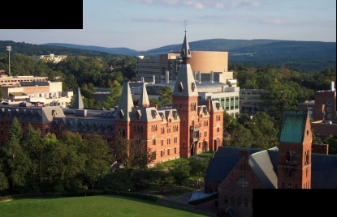
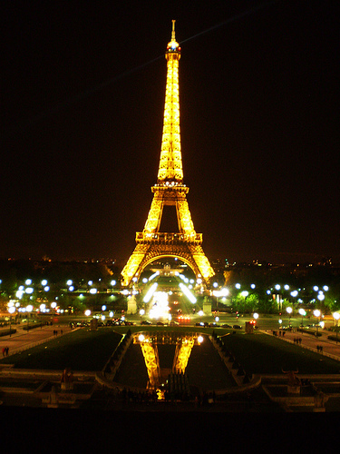

# Assignment 2 : Warping, Matching, Stitching, Blending

User Name : hrajash, jp109, mmanurn, vanshah

## Part 1: Image matching and clustering

### a) Finding matching key points between images

In this part we have used ORB features to detect corners and other feature points. ORB produces a 32-dimensional vector that is supposed to be invariant to image transformations like scaling, rotation, etc. Input to the ORB is 2 images where you want to find the feature points and it gives out key points and descriptors as the output. Each key point is described through the descriptor.

ORB provides the given number of features in each image. To determine the corresponding key points in both the images we take a ratio of Euclidean distances between the closest match and the second-closest match. This ratio is then compared to a threshold and best correspondences are retained. Based on the trial and error in the given images we decided the threshold to be 0.8

#### Sample output using all the features


#### Sample output using the threshold


### b) Clustering given set of images into k groups

```
Following are the methods used:
i) Kmeans with descriptors
ii) Kmeans with bag of visual words (BOVW)
iii) Hierarchical clustering with simple, average and complete linkage with euclidean distance
```
#### kmeans with descriptors

In this method we got the descriptors from ORB and stacked these descriptors for every image and it was passed as features to
kmeans algorithm with Euclidean distance to compute cluster centers

#### Kmeans with bag of visual words (BOVW)

In this method we took the descriptors of the input images and created a bag of visual words (Patches of images). Then for each of these patches get the count in each image and this matrix will be sent to kmeans algorithm for clustering

#### Hierarchical clustering with simple, average and complete linkage with euclidean distance

In this method we first calculate the count of matching descriptors between every pair of images (N * N-1). Then this count matrix is passed as input to the Hierarchical Agglomerative clustering. Here we tried different linkage methods which include simple, average and complete linkage with euclidean distance.

```
How to run:

./a2 part1 k img_1.png img_2.png ... img_n.png output_file.txt

where k is number of clusters and followed by images that needs to be clustered
output will be stored in output_file.txt where each line defines a cluster of images
```

### c) Clustering all the images into given 10 groups

Using the above mentioned clustering techniques we tried to cluster the given 93 images.
The performance is measured quantitatively using the following:
For the N images in the dataset, consider each of the possible N(N - 1) pairs of images. Let TP be the number of pairs where your clustering correctly assigned them to the correct cluster, and TN be the number of pairs where your clustering correctly assigned them to different clusters. The Pairwise Clustering Accuracy is then simply TP+TN/(N*(N-1))

```
Accuracies obtained:

kmeans with descriptors: 41%
Kmeans with bag of visual words: 41.2%
Hierarchical clustering with simple linkage: 12.1%
Hierarchical clustering with average linkage: 21.6%
Hierarchical clustering with complete linkage: 41.4%
```

As we can see from the above accuracies Kmeans with bag of visual words and Hierarchical clustering with complete linkage gave us the best results

#### Examples of images where clustering was correctly classified


#### Examples of images where clustering was incorrectly classified


After analysing the results we could see that Eiffel tower, big ben, and london eye was easily getting clustered whereas tate modern and trafalgarsquare were incorrectly clustered.

## Part 2: Image Transformations

### a) Applying the given transformation

```
[[0.907 0.258 -182],
[-0.153 1.44 58],
[-0.000306 0.000731 1]
```

#### Sample image without transformation


#### Sample image with transformation


### b) Calculating transformation matric given the pairs of corresponding points across 2 images

```
How to run:

./a2 part2 n book1.jpg book2.jpg book_output.jpg 318,256 141,131 534,372 480,159 316,670 493,630 73,473 64,601

where n is the type of transformation, n = 1 means only a translation, n = 2 means a Euclidean (rigid) transformation, n = 3 means an affine transformation, and n = 4 means a projective transformation transformation, and the remaining parameters indicate the feature correspondences across images (e.g. point (img1 x1, img1 y1) in img 1.png corresponds to (img2 x1, img2 y1) in img 2.png)
```

```
when n is 1 then we have only translation, hence the matrix becomes 

[[1, 0, t_x], [0, 1, t_y], [0, 0, 1]]
when n is 2 then we have both translation and rotation, henc ethe matrix becomes 
[[cos_t, -1 * sin_t, t_x], [sin_t, cos_t, t_y], [0, 0, 1]]
..
n = 4, [[x_1, y_1, 1, 0, 0, 0, -1 * x_1 * xp_1, -1 * y_1 * xp_1],
       [0, 0, 0, x_1, y_1, 1, -1 * x_1 * yp_1, -1 * y_1 * yp_1],
       [x_2, y_2, 1, 0, 0, 0, -1 * x_2 * xp_2, -1 * y_2 * xp_2],
       [0, 0, 0, x_2, y_2, 1, -1 * x_2 * yp_2, -1 * y_2 * yp_2],
       [x_3, y_3, 1, 0, 0, 0, -1 * x_3 * xp_3, -1 * y_3 * xp_3],
       [0, 0, 0, x_3, y_3, 1, -1 * x_3 * yp_3, -1 * y_3 * yp_3],
       [x_4, y_4, 1, 0, 0, 0, -1 * x_4 * xp_4, -1 * y_4 * xp_4],
       [0, 0, 0, x_4, y_4, 1, -1 * x_4 * yp_4, -1 * y_4 * yp_4]]
```
#### output

a) book1.jpg


b) book2.jpg


c) output


The goal was to warp image (b) to appear as if it were taken from the same perspective as image (a), producing image (c). The transformation matrix was used to get the output image using inverse transformation. To methods were created, nearest_neighbor and bilinear_interpolation.

After getting the correct candidate coordinate for the new image by applying the the transformation matrix, if it is an integer coordinate, there are no problems. However, we need a way to figure out the pixel intensity when the coordinates are float pointers. Nearest neighbor method simply uses the closest integer coordinate. Bilinear interpolation averages out the 4 closest pixel points to get a new intensity value. Code default is bilinear interpolation since it produced better results with small overhead.

## Part 3: Automatic image matching and transformations

Here the goal is to automatically find the transformation between two images, to transform one into the coordinate system of the other, and then to produce a "hybrid" stitched image that combines the two together. One application of this is to find create panoramas (Figure 6). Another might be to align two images taken at different times (e.g., from satellites) to be able to quickly spot differences between them.

```
How to run:

./a2 part3 image_1.jpg image_2.jpg output.jpg
```

```
Steps followed:

1) Extracting key points using ORB descriptor from both the input images
2) Finding the relative transformation between the images using RANSAC
3) Transform images to same coordinate system
4) Blending images together
```

```
RANSAC Algorithm

1. Randomly select 4 coordinates from both the images which are correspondent to each other
2. Calculate the transformation matrix using these 4 key pairs
3. Using the above calculated transformation matrix count the number of inliers. Here we took a room of 5 pixels
4. If the count of inliers is greater than the threshold τ, then we stop the process and return the inlier points and the projection matrix, else repeat steps 1 to 3, N number of times, where N = log(1-p)/log(1-(1-v)^m), where p is confidence, 1-v is probability of outlier and m is the number of points

We set the threshold τ to be 0.6, i.e total number of inliers should be 60% of the overall key point pairs
```

#### output

This is an output using the example image of part 3

a) left.png


b) right.png


c) output



d) eiffel_19.jpg


e) eiffel_18.jpg



f) output


## Discussion
Though part3 gives some reasonable output on similar images, images being off can produce a pretty bad result. Even when the target image and the to be warped image are swapped, a good result can turn in to a bad result like this

a) only difference is swapping eiffel_19 and eiffel_18 from the previous example


RANSAC is a random algorithm and the need for hyperparameters makes it more unstable. We could see that even when the result was good, there were several noisy transformation matrices.

Also, if the lighting of both of the images can be different, like the eiffel example. It is not implemented here, but this can be overcome with poisson blending.
